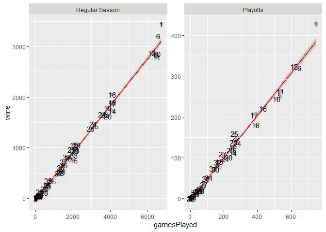

ST558 Project 1
================
Tao Sun
2020-06-09

# **JSON data description**

**JSON** (JavaScript Object Notation) is a lightweight and flexible data
format that is easy for humans to read and for machines to parse. JSON
has become a common format used in:

  - Public APIs (e.g., Twitter)
  - NoSQL databases as a document format (e.g., MongoDB)
  - Relational databases as a new column type (e.g., PostgreSQL)

JSON format is text only and independent to any programming language, so
it is a good way to store data.

[Wikipedia introduction](https://en.wikipedia.org/wiki/JSON) and [JSON
syntax introduction](http://json.org/).

# **Ways to read JSON data into R**

There three major R packages available for reading JSON data into R
(rjson, RJSONIO and jsonlite). Examples to compare behavior and
performance of those three packages are
[here](https://rstudio-pubs-static.s3.amazonaws.com/31702_9c22e3d1a0c44968a4a1f9656f1800ab.html).
I prefer jsonlite because it provides more options for manipulating the
format and most importantly we can get well formatted data by default.

# **Access NHL records ‘Franchise’ API and pulldown JSON data**

Function used to pull down “Francise” records.

Pull down data.

# **Exploratory data analysis**

Cities with more than one NHL teams in the history

| City Name    | Team Number |
| :----------- | ----------: |
| Montreal     |           2 |
| New York     |           2 |
| Philadelphia |           2 |
| St. Louis    |           2 |

# **The team with highest winning ratio in NHL history**

All records of number of games a team played and wined was retrieved and
ploted as below. all the teams seems have very similar winning ratios,
except team “Montréal Canadiens”(\#1) showed extraordinary winning rate
in both regular season and playoffs. Interestingly, team “Edmonton
Oilers”(\#25) has much better performance in playoffs than in the
regular seasons.

    ## Warning: namespace 'plyr' is not available and has been replaced
    ## by .GlobalEnv when processing object '<unknown>'

<!-- -->

We can also see this from below two tables. Montréal Canadiens has the
highest wining ratio among teams who played more than 2500 games. Again,
Edmonton Oilers’s wining ratio is much higher in playoffs than in
regular seasons.

| teamName             | franchiseId | gamesPlayed | wins | ratio |
| :------------------- | ----------: | ----------: | ---: | ----: |
| Vegas Golden Knights |          38 |         235 |  133 |  0.57 |
| Dallas Stars         |          15 |        2053 | 1061 |  0.52 |
| Montréal Canadiens   |           1 |        6731 | 3449 |  0.51 |
| Winnipeg Jets        |          35 |         693 |  352 |  0.51 |

Winning rato in regular seasons

| teamName             | franchiseId | gamesPlayed | wins | ratio |
| :------------------- | ----------: | ----------: | ---: | ----: |
| Edmonton Oilers      |          25 |         264 |  159 |  0.60 |
| Vegas Golden Knights |          38 |          27 |   16 |  0.59 |
| Montréal Canadiens   |           1 |         749 |  429 |  0.57 |
| Toronto Arenas       |           5 |           7 |    4 |  0.57 |

Winning rato in regular seasons

# **Further check Montreal Canadiens team’s plalyers in each position**

## The former and active players in each position.

Seems that Montreal Canadiens need more player on the right wing
position.

|                | Center | Defence | Left Wing | Right Wing |
| -------------- | -----: | ------: | --------: | ---------: |
| Former player  |    178 |     218 |       165 |        163 |
| Current player |     17 |      27 |        12 |          8 |

## Who is the active player got highest average scores/season in the team.

Tomas Tatar is the player in the team who got the highest average
scores/season. Max Pacioretty is definitely the super star in the team
who performed so well in the past 10 seasons.

    ## # A tibble: 64 x 4
    ##    Name              seasons points AvergePoints
    ##    <chr>               <int>  <int>        <dbl>
    ##  1 Tomas Tatar             2    119         59.5
    ##  2 Max Domi                2    116         58  
    ##  3 Alexander Radulov       1     54         54  
    ##  4 Max Pacioretty         10    448         44.8
    ##  5 Alex Galchenyuk         6    255         42.5
    ##  6 Brendan Gallagher       8    334         41.8
    ##  7 Nick Suzuki             1     41         41  
    ##  8 P.K. Subban             7    278         39.7
    ##  9 Jonathan Drouin         3    114         38  
    ## 10 Phillip Danault         5    170         34  
    ## # ... with 54 more rows
